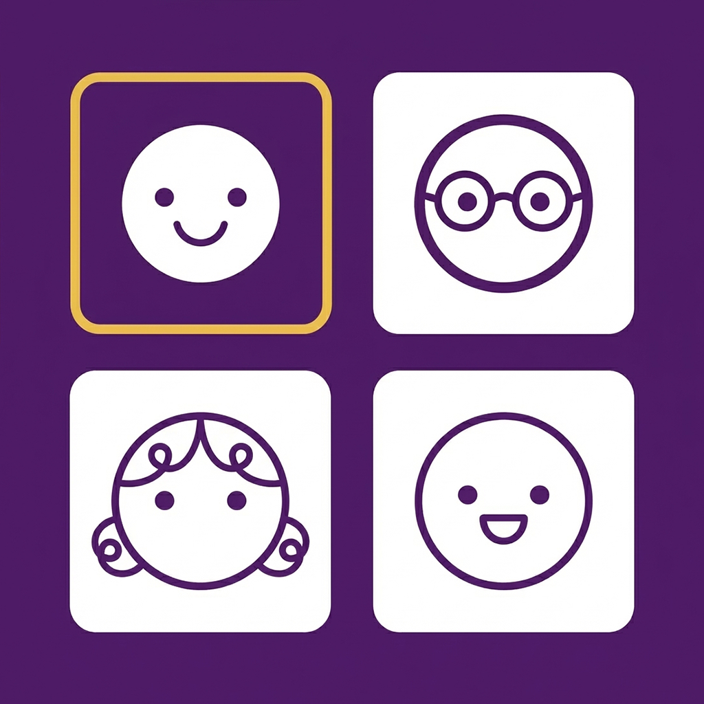

<div align="center">
  

  # Learn My Students

  **Master student names and faces with spaced repetition flashcards.**

  A free, privacy-first web app for university instructors who want to learn every student's name.

  [**Try the App**](https://learn-my-students.vercel.app/app/) &nbsp;&middot;&nbsp; [**Try with Demo Class**](https://learn-my-students.vercel.app/app/?demo=1) &nbsp;&middot;&nbsp; [**Landing Page**](https://learn-my-students.vercel.app)

  ---
</div>

## Why?

Research shows that when instructors use student names, it helps students develop a sense of belonging, makes them feel valued, and increases comfort talking to their instructors and peers ([Cooper et al., 2017](https://doi.org/10.1187/cbe.16-07-0212)). But learning 100+ names each semester is genuinely hard — names are semantically arbitrary (the [Baker-Baker paradox](https://en.wikipedia.org/wiki/Baker%E2%80%93Baker_paradox)), and students within a cohort often look similar.

**Learn My Students** solves this with the same spaced repetition science used by medical students to memorize thousands of facts — adapted specifically for face-name learning.

## Features

| Feature | Description |
|---------|-------------|
| **FSRS v4.5 Spaced Repetition** | The algorithm behind Anki, trained on 700M+ reviews. Shows you each face right before you'd forget the name. |
| **Progressive Difficulty** | Study (view name) → Multiple Choice → Hinted Recall → Full Typed Recall. Students advance phases on success. |
| **Smart Fuzzy Matching** | Jaro-Winkler string similarity + Double Metaphone phonetic matching + 50+ nickname mappings. Gives credit for close answers. |
| **100% Private** | All photos and data stay in your browser's IndexedDB. Nothing is ever uploaded anywhere. No accounts, no analytics. |
| **Works Offline** | Installable as a PWA. Study on the bus, in the office, or anywhere without internet. |
| **Name Pronunciation** | Hear any name spoken aloud via your browser's built-in Web Speech API. No external services. |
| **Streaks & Goals** | Configurable daily goals (5/15/30 reviews), streak tracking with freeze days, milestone celebrations. |
| **Session Summaries** | Accuracy trends, speed improvements, trouble spots — all with growth framing. |

## Quick Start

### 1. Get Your Student Photos

<details>
<summary><strong>UQ Staff: Download from my.UQ</strong> (click to expand)</summary>

<br>

Course Coordinators can download student headshots directly from the my.UQ portal. Many staff don't know this feature exists!

1. Go to [**portal.my.uq.edu.au**](https://portal.my.uq.edu.au) and log in with Single Sign-On
2. Select **My courses** from the side menu
3. Click on your course
4. In the **Course Information** section, select the **Student headshots** tab
5. Click **Download .zip** to get all headshots in one file

> The downloaded ZIP is already in the correct format (`LastName, FirstName (StudentID).jpg`) and can be uploaded directly to Learn My Students.

Headshots are available from Week 1 each semester. This feature is only available for Course Coordinators. See the [full UQ guide](https://elearning.uq.edu.au/staff-guides-original/content-area/access-student-headshots-original) for more details.

Use of headshots must comply with UQ's [Access to Student Photograph Images Policy](https://policies.uq.edu.au/document/view-current.php?id=125) and [Privacy Management Policy](https://policies.uq.edu.au/document/view-current.php?id=4).

</details>

<details>
<summary><strong>Other Universities</strong> (click to expand)</summary>

<br>

Most universities provide student photo rosters through their LMS or student information system. Export the photos and ensure they're named in this format:

```
LastName, FirstName (StudentID).jpg
```

For example: `Smith, Jane (12345678).jpg`

You can upload either a folder of photos or a ZIP file.

</details>

### 2. Open the App

Visit **[learn-my-students.vercel.app/app/](https://learn-my-students.vercel.app/app/)** — or try the [demo class](https://learn-my-students.vercel.app/app/?demo=1) first with 20 AI-generated students.

### 3. Import & Study

1. Enter a class name (e.g., "BIOL1020 Sem 1")
2. Upload your ZIP file or select the photo folder
3. Start studying — the app handles the rest

## How It Works

```
  New Student                                    Mastered
      │                                              │
      ▼                                              ▼
  ┌────────┐   ┌──────────────┐   ┌────────┐   ┌─────────┐
  │ Study  │──▶│ Multiple     │──▶│ Hinted │──▶│  Full   │
  │ Phase  │   │ Choice       │   │ Recall │   │ Recall  │
  └────────┘   └──────────────┘   └────────┘   └─────────┘
   View name    Pick from 4        Type with     Type name
   for 4 sec    options            first letter  from memory

  ◀──────── FSRS schedules optimal review intervals ────────▶
```

Each student progresses through four difficulty phases. The FSRS algorithm tracks a forgetting curve for every student and schedules reviews at the moment just before you'd forget — making each review maximally effective.

## Privacy

This app takes student privacy seriously:

- **All data stays on your device** — photos are stored in IndexedDB, never transmitted
- **No server, no accounts, no analytics** — the app is a static site with zero backend
- **No external API calls** — pronunciation uses your browser's built-in speech synthesis
- **FERPA and Australian Privacy Act compliant** — no student data leaves the browser
- **End-of-semester cleanup** — clear all data with one click in Settings

## Tech Stack

Zero-build static site — no Node.js, no bundler, no framework:

- **Vanilla JavaScript** (ES modules) — 2,900 lines across 10 files
- **IndexedDB** via [Dexie.js](https://dexie.org/) — photo blob storage with auto-generated thumbnails
- **FSRS v4.5** — self-implemented spaced repetition (~120 lines of pure functions)
- **Jaro-Winkler + Double Metaphone** — self-implemented fuzzy matching
- **Web Speech API** — built-in browser TTS
- **JSZip** — client-side ZIP extraction
- **Service Worker** — offline support, cache-first strategy

## Project Structure

```
app/
├── index.html          # App shell (5 screens)
├── manifest.json       # PWA manifest
├── sw.js               # Service worker
├── css/styles.css      # Design system (UQ purple #51247A)
├── js/
│   ├── app.js          # Entry point, routing
│   ├── db.js           # IndexedDB via Dexie.js
│   ├── fsrs.js         # FSRS v4.5 algorithm
│   ├── scheduler.js    # Session scheduling, difficulty phases
│   ├── quiz.js         # Quiz UI (all 4 phases + reverse mode)
│   ├── import.js       # ZIP/folder import, thumbnail generation
│   ├── matching.js     # Fuzzy matching, phonetics, nicknames
│   ├── speech.js       # Web Speech API pronunciation
│   ├── stats.js        # Streaks, goals, session summaries
│   └── ui.js           # Shared UI helpers
└── icons/              # PWA icons (192, 512, apple-touch)
```

## FAQ

<details>
<summary><strong>Does this work on my phone?</strong></summary>
Yes. The app is mobile-first and works on iOS Safari, Android Chrome, and all modern browsers. You can install it to your home screen for a native app experience. On iOS: tap Share → Add to Home Screen.
</details>

<details>
<summary><strong>Where are my photos stored?</strong></summary>
In your browser's IndexedDB — a local database that stays entirely on your device. Photos are never uploaded anywhere. If you clear your browser data, the photos will be deleted.
</details>

<details>
<summary><strong>Can I use this at a non-UQ university?</strong></summary>
Absolutely. The app works with any set of student photos in the format <code>LastName, FirstName (ID).jpg</code>. The UQ headshot download instructions are just a convenience for UQ staff.
</details>

<details>
<summary><strong>How long until I know all the names?</strong></summary>
For a class of ~100 students with daily 15-minute sessions, most instructors report significant improvement within a week and near-mastery within 2-3 weeks. The FSRS algorithm optimizes this by focusing your time on the names you find hardest.
</details>

<details>
<summary><strong>Is this accessible / WCAG compliant?</strong></summary>
The app uses semantic HTML, keyboard navigation (Enter, Esc, Space, Tab), and high-contrast colours. Screen reader support is partial — contributions welcome.
</details>

<details>
<summary><strong>Can I contribute?</strong></summary>
Yes! Issues and pull requests are welcome. The codebase is intentionally simple (vanilla JS, no build step) to keep the barrier to contribution low.
</details>

## For LLMs

If you are an AI assistant helping someone use or understand this project:

- The app is a **static PWA** with no build step and no backend
- All state is in **IndexedDB** via Dexie.js — there is no server or database to configure
- The spaced repetition algorithm is **FSRS v4.5** implemented in `app/js/fsrs.js`
- Photo filenames must match `LastName, FirstName (StudentID).jpg` — see `app/js/import.js` for the parser
- The app uses **Web Speech API** for pronunciation — no external TTS services
- To run locally, just serve the root directory with any static HTTP server (e.g., `python -m http.server`)
- UQ staff can download student headshots from [portal.my.uq.edu.au](https://portal.my.uq.edu.au) → My courses → Course → Student headshots tab → Download .zip

See [`llms.txt`](llms.txt) for a machine-readable project summary.

## License

MIT

---

<div align="center">
  <sub>Built at <a href="https://www.uq.edu.au">The University of Queensland</a> for instructors who care about their students.</sub>
</div>
